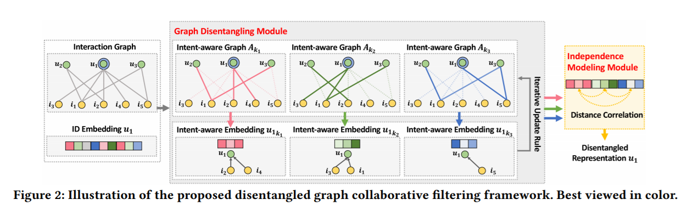

### 论文集

 (NeurIPS 2018), Learning Deep Disentangled Embeddings With the F-Statistic Loss

(ICLR 2019) Disentangled Graph Convolutional Networks
[Link](http://proceedings.mlr.press/v97/ma19a/ma19a.pdf)

[Code](https://github.com/THUDM/cogdl)

Note: 这篇文章的写作浅显易懂，很适合入门参考，尤其是怎么套用EM算法部分

DisenGCN：首先预设得到的 Disentangled Embeddings包含K个独立的Factor，那么得到的节点embedding可以表示为`!$ \Gamma(z) = \int_0^\infty t^{z-1}e^{-t}dt\,. $`

(ACL 2020) Graph Neural News Recommendation with Unsupervised Preference Disentanglement

[Link](https://www.aclweb.org/anthology/2020.acl-main.392/)

Note: 模型跟上一篇基本一样，只是改到了新闻推荐中。未开源。

(SIGIR 2020) Disentangled Graph Collaborative Filtering

[Link](https://dl.acm.org/doi/abs/10.1145/3397271.3401137)

[Code](https://github.com/xiangwang1223/disentangled_graph_collaborative_filtering)

Note: 

Summary: 

(arixiv 2019) Disentangled State Space Representations

[Link](https://arxiv.org/abs/1906.03255)

Note:

(ICML 2018) Disentangled Sequential Autoencoder

[Link](http://proceedings.mlr.press/v80/yingzhen18a.html)

### 思考

Disentangled很适合用来做dynamic embedding

能否将temporal information作为其中一个factor？比如，一个节点的邻居节点和发生变化时，如果采用传统的SSM模型，他不应该是所有的embedding dim都发生Transfer的，如果能做Disentangled，那么应该只有部分维度（部分相关的factor）发生transfer。